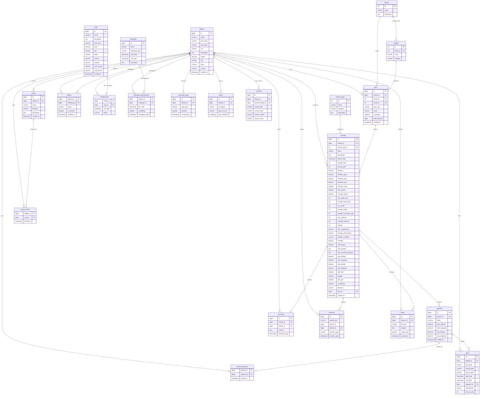

# Runaway Labs - Strava Data Export Entity Relationship Diagram

## ERD Overview

## Key Relationships

### Primary Relationships
1. **Athletes** are the central entity, connected to all user-generated content
2. **Activities** are the core data points, linked to athletes, gear, and geographic data
3. **Gear** (bikes/shoes) connects to activities through usage tracking
4. **Social connections** through follows, comments, and reactions

### Secondary Relationships
1. **Geographic data** through routes and segments
2. **Club participation** through memberships
3. **Challenge participation** and goal setting
4. **Media attachments** to activities

### Reference Data
1. **Activity types** for categorization
2. **Brands and models** for gear normalization
3. **Challenges** as reusable entities

## Normalization Benefits

1. **Eliminates redundancy** in brand/model data
2. **Supports referential integrity** across social connections
3. **Enables efficient querying** of activity patterns
4. **Scales for multiple athletes** in future expansions
5. **Maintains audit trails** through timestamps